# Screen Studio 对照体验与 RecordReady 提升方案

2026-09-25 · 待评审方案，未实施

## 结论

RecordReady 下一轮应优先改善“当前配置看得见、操作靠近对象、不同阶段只突出必要动作”。现有面板的基础样式已经较完整，主要差距在信息组织和操作位置。建议保留 RecordReady 的橙色品牌、中文与英文、口播提词、屏幕视频与摄像头原片分别保存；借鉴 Screen Studio 的紧凑录制条、就近设置和分阶段呈现。

本轮只体验、截图、阅读当前实现及编写方案，没有修改产品代码或录制配置，没有构建、重签或发布。涉及功能及交互行为变化的建议单独列为 B 类，必须先经用户确认。本文件不覆盖已经批准的 `design.md`；批准后再更新设计规范。

## 调研范围与证据边界

- 实际操作本机 Screen Studio **3.7.5-4595**：新录制条、摄像头菜单、麦克风菜单、更多菜单、演讲备注及其设置、录制偏好、显示器选择、拖选区域、比例菜单。
- 实际打开当前 RecordReady 原生包：主工具条、摄像头、声音、区域与尺寸、保存位置、稿件编辑。代码基线为本轮开始时干净的 `codex/mac-phase-one` 工作区；对照 `App.tsx`、原生浮层定位和 `design.md`。
- 没有开始真实录制，也未改动系统权限。Screen Studio 的录制中、保存、编辑与导出体验未实测；RecordReady 的完整浮窗组合、录制中布局也未在本轮验收。
- Screen Studio 摄像头、麦克风及更多菜单可读取菜单文本，但工具无法截图这些原生菜单，相关结论仅为操作与可访问性树证据。没有摄像头人物画面进入本轮报告。
- 选区截图可证明控制布局；工具返回的透明覆盖层背景为纯色，不能据此判断真实桌面透视效果、遮罩浓度或跨应用层级。
- 所有下列 PNG 均在本轮采集、保存后重新打开检查。截图尺寸各不相同，不据此声称像素一致或给出虚假的一致率。

## 体验步骤

| 步骤 | 实际操作及观察 | 体验评价与限制 | 证据 |
|---|---|---|---|
| 1 | 打开新录制条：左侧录制对象，中间设备，右侧更多 | 分组清楚，配置无需展开即可读；长相机名会截断 | 图 01 |
| 2 | 摄像头、麦克风菜单 | 同一入口完成设备选择和停用；相机菜单区分隐藏预览与停止录相机。仅菜单文本证据 | 下方菜单记录 |
| 3 | 更多 → Show speaker notes → 齿轮 | 独立备注窗，播放常驻，速度/透明度/字号在局部浮层；未测试滚动与成片排除 | 图 03、04 |
| 4 | 打开 Settings → Recording | 低频设置集中管理，标签、说明、控件横向对应 | 图 05 |
| 5 | 点击 Display | 目标名称、尺寸/FPS 与开始动作在目标区域就地显示；未启动录制 | 图 06 |
| 6 | Record area，拖出区域，打开比例菜单 | 选区周围有调整柄；尺寸、位置、比例与开始集中在选区下方 | 图 07、08 |
| 7 | 打开 RecordReady 主条与摄像头、声音面板 | 面板字段明确、焦点环可见；主条未直接呈现设备名和相机开关状态 | 图 09、10、12 |
| 8 | 打开 RecordReady 区域与尺寸 | 预设完整且已选中项明显；整个面板较长，显示器和输出配置混在一起 | 图 11 |
| 9 | 打开 RecordReady 保存位置、稿件编辑 | 保存位置入口却显示“保存结果”，并出现“授权并预览”；编辑区已有完整独立面板 | 图 13、14 |

菜单记录（本轮实际读取，不能当作截图证据）：

- 摄像头：真实设备名、Max camera resolution（720p/1080p/4K）、Hide camera preview、Don't record camera。
- 麦克风：真实设备列表、Reduce noise and normalize volume、Disable auto gain control、Don't record microphone。未切换设备或音频处理选项。
- 更多：隐藏桌面图标、录制时隐藏 Dock 图标、区域高亮、录制后快速分享、Show speaker notes、倒计时、Advanced、Settings。
- 开始按钮旁菜单：录后创建项目、复制到剪贴板、创建分享链接、保存到文件及快速导出设置。仅检查菜单，没有导出或分享。

## 当前差距与改进方向

| 优先级 | 当前表现与证据 | 建议呈现及操作位置 | 分类 |
|---|---|---|---|
| P1 | 主条相机、麦克风只有图标，打开面板才能确认设备（09、10、12） | 图标旁显示真实设备短名；关闭时显示“相机已关闭 / 静音录制”。长名截断并提供完整 Tooltip。电平紧邻麦克风 | A：展示 |
| P1 | “保存位置”打开“保存结果”，空结果阶段还有启动按钮和大块空白（13） | 未录制时标题为“保存位置”，只呈现当前目录、选择目录和打开文件夹；实际保存结果另按会话阶段呈现 | 标题/高度为 A；拆分路由与移除重复动作属 B |
| P1 | 录制区域与输出分辨率虽有说明，但说明位于长面板底部（11） | 输出数值明确标注“输出”；将“拖动边框只改桌面范围，不改变输出像素”放在相关控件旁 | A：语义与说明 |
| P1 | 比例与分辨率两个区域工具条按钮都打开同一个 size 面板（代码观察） | 若保留现有行为，合为一个明确入口“输出 · 9:16 · 1080×1920”；若要两个入口，就分别打开匹配的局部面板 | B：入口调整；独立比例规则须确认 |
| P1 | 尺寸面板同时展开 12 个预设和自定义，约 860px 宿主高度（11、代码） | 用“竖屏/横屏/其他”分组切换或折叠，选中尺寸始终可见；自定义作为展开项。保留全部已有预设、校验和应用动作 | B：信息架构与交互 |
| P2 | 启动前已有计时、状态、多枚同权重图标，配置摘要却少（09） | 准备阶段突出设备与范围；录制阶段突出红点、计时、停止；低频外观与目录降级为次要入口 | A：视觉权重；隐藏/收起入口属 B |
| P2 | 摄像头设置现已包含布局、四角和镜像，功能语义清楚（10） | 保留预览齿轮就地打开；将“四角位置”排成 2×2 空间映射，保持文字标签、单选语义和现有值 | A：排布；不改变预览逻辑 |
| P2 | 提词工具条全部常驻，英文按当前代码需两行（代码观察，非本轮现场截图） | 可保留“编辑、播放/暂停”常驻，字号/速度移入提词设置；回到开头保持易达 | B：工具条行为与旧规范不同，先确认 |
| P2 | 未准备时电平为 0，单靠灰条难区分“未监听”与“安静”（09、12） | 根据已有真实阶段显示“预览后显示输入电平”；静音显示明确文字。无真实诊断依据时不显示“声音正常” | A：状态说明；增加试音/诊断属 B |
| P2 | 设置已有就近锚点与边缘限位，但主条、选区、提词各有入口（代码观察） | 明确对象归属，按触发按钮定位；放不下时翻转/平移，箭头仍对应入口，关闭后焦点回到原按钮 | 保持已有规则为 A；新自动布局策略属 B |

P1 表示应在下一轮集中验收前优先处理的易误解问题，不表示数据丢失或安全漏洞。

## 建议的界面分工

| 界面位置 | 常驻内容 | 点击后在哪里操作 | 保留的产品规则 |
|---|---|---|---|
| 主录制条 | 状态、设备摘要、输入电平、主动作；目录/应用设置为次要入口 | 摄像头和声音在各自按钮附近展开 | 不新增系统音频、窗口录制或 Device 模式 |
| 录制线框旁 | “输出 · 比例 · 分辨率”及移动把手 | 显示器和输出设置就近打开 | 桌面范围与输出分辨率分开；倒计时后锁定区域 |
| 摄像头预览角落 | 设置齿轮 | 设备、预览布局、位置、镜像 | 小窗/铺满/镜像只影响预览，原片画幅不变 |
| 提词区 | 正文、明确拖动入口、播放状态 | 编辑稿件仍独立；字号/速度可在局部设置（B 类） | 正文穿透、录制中禁改稿件、提词暂停不暂停录像 |
| 录制中主条 | 录制中、计时、停止；麦克风状态 | 需要调整的既有功能仍可找到 | 不添加暂停录像；主题/语言变化不得重启采集 |
| 保存结果浮层 | 本次每份文件的真实结果、目录、再录一条 | 停止并完成保存后出现；异常按实际状态反馈 | 部分保存和中断分别表达，成功文件保留 |

以上为建议布局，不是已批准的新视觉稿。特别是工具条收纳、尺寸分组、开始动作位置会改变旧设计中的操作路径，实施前需确认。

### 位置与展示细则

1. 主条采用内容自适应宽度，不靠扩大空白来容纳英文；主动作完整显示，设备名可以限宽但需可查看全文。沿用现有语义颜色和清晰焦点环。
2. 入口、浮层和受影响对象之间形成可理解的对应：相机齿轮不打开应用设置，区域控件不打开混合总设置，提词设置不跳走到主条。
3. 简单设备选择优先紧凑列表；包含预览布局和说明的设置保留面板，不为模仿菜单而丢失可读性。
4. 不照搬 Screen Studio 的全部按钮。其 Display/Window/Area/Device 反映四种能力，RecordReady 当前只有单显示器内固定矩形范围，不能放出没有实现的入口。
5. Screen Studio 的比例选择与选区大小关联；RecordReady 的输出比例又约束录制线框。若将比例独立成新控件，必须先规定切换时分辨率、选区边界与默认值如何变化，不能只换 UI。
6. 保存位置面板按内容决定高度；关键错误保持行内、可读、可操作。普通设置仍一次只开一个，内部下拉关闭不应连带关闭父面板。

## 需要用户确认的 B 类决策

| 编号 | 推荐选择 | 具体变化与代价 |
|---|---|---|
| B1 | 拆分“保存位置”和“本次保存结果” | 两个语义入口共享目录组件，录前不再出现结果标题和重复开始按钮；不改变文件保存逻辑 |
| B2 | 尺寸预设按分组展开，先保留一个输出设置入口 | 减少面板高度；预设仍即时生效，自定义仍点击应用。暂不引入独立的比例切换规则 |
| B3 | 提词字号/速度收进就近设置 | 减少长期遮挡，但调整多一次点击；现有固定工具条顺序需要更新。建议播放/暂停、编辑、回到开头仍可直接到达 |
| B4 | 录制中收起不可改的配置，只保留状态摘要 | 降低误点和视觉干扰；必须留可发现的入口访问仍允许调整的预览、主题、语言等功能 |
| B5 | 暂时保持“授权并预览 → 开始录制”两步 | 自动准备、自动请求权限或把开始按钮搬到选区，会改变启动流程；本轮不建议与 UI 优化混做。可以将含混文案调整为“准备录制”，权限问题再按真实状态提示 |

B 类未批准前，仅可据本方案继续讨论或出明确视觉稿，不直接开发。A 类虽然不新增功能，本轮也尚未实施。

以下借鉴点涉及新增能力，建议留到后续独立需求：隐藏摄像头预览但继续录相机、保存区域预设、选区数字坐标编辑、键盘微调选区、提词透明度、可配置倒计时、全局录制快捷键、系统音频、窗口录制、摄像头输出分辨率选择、录像暂停、快速分享与剪辑。不得因为 Screen Studio 有，就自动纳入当前项目。

## 建议实施顺序与验收

**第一批：呈现纠偏。** 设备摘要、明确输出标签、麦克风阶段说明、四角位置排布、面板高度与入口标题。保留现有组件库和 token；这批尽量不动 Swift 采集与会话状态机。

**第二批：获准后的路径优化。** 按 B1–B4 执行保存入口拆分、尺寸分组、提词收纳、录制中布局。先给主条、区域设置、提词设置的完整视觉与状态稿，再一次性开发，减少重复打包及系统授权。

**第三批：统一构建后集中验收。** 不反复重跑已通过的基础录制项，重点验证改变的窗口、焦点、状态和排除行为：

- 不打开设置也能识别当前相机/麦克风、静音状态、输出尺寸；不能把“未准备”展示为“输入正常”。
- 每个入口与面板标题一致。关闭恢复焦点；Esc 先关子菜单再关父层；拖动后入口与浮层位置仍对应。
- 中文/英文、浅色/深色、长设备名与长路径无主动作截断；小屏所有控件可达，底部说明和主按钮不被裁切。
- 调整预览布局/镜像只影响预览；调整输出与拖动录制范围的语义不混淆。
- 提词编辑内容、字号、速度和播放状态在窗口开关、语言切换后保持正确；明确“提词暂停”不会暂停录像。
- 真实短录制检查所有被移动/重组的辅助窗口均不入片；停止、保存中和真实保存结果各自有清楚状态。保存中退出的既有专项仍单独跟踪。
- 不用截图代替原生穿透、屏幕排除、读屏或真实对比度测试。Screen Studio 选区调整柄暴露键盘操作说明，RecordReady 是否新增键盘调整另行确认。

## 本轮截图

### 01 · Screen Studio 录制入口：配置摘要直接可见

### 03–04 · 独立备注与就近设置：播放突出，低频设置收纳

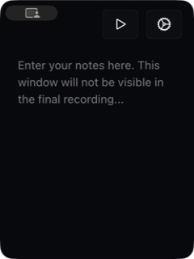

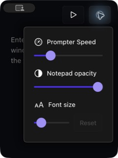

### 05 · 录制偏好：说明与控件对应

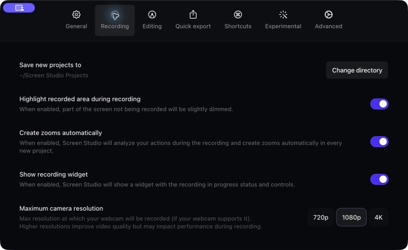

### 06–08 · 目标与区域选择：动作贴近选中对象

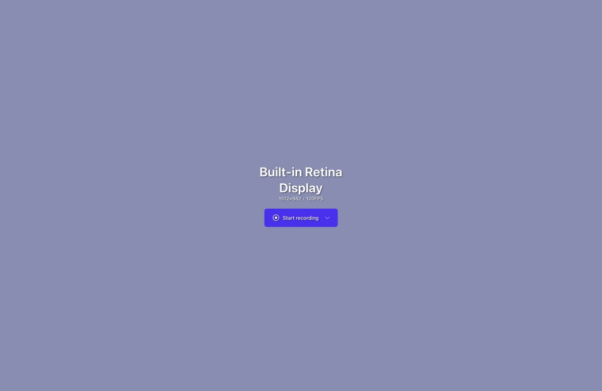

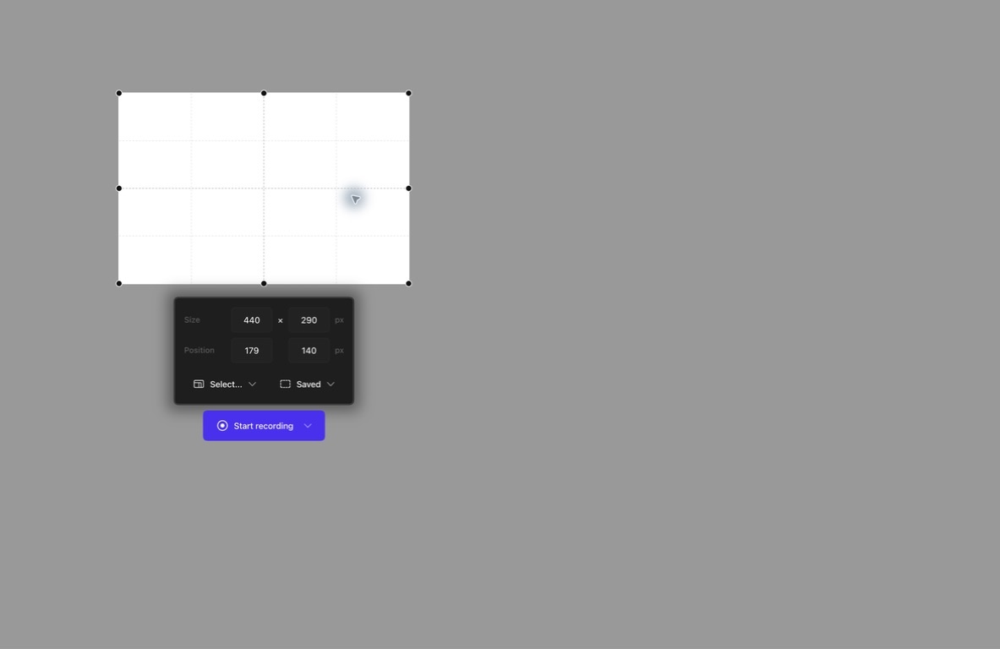

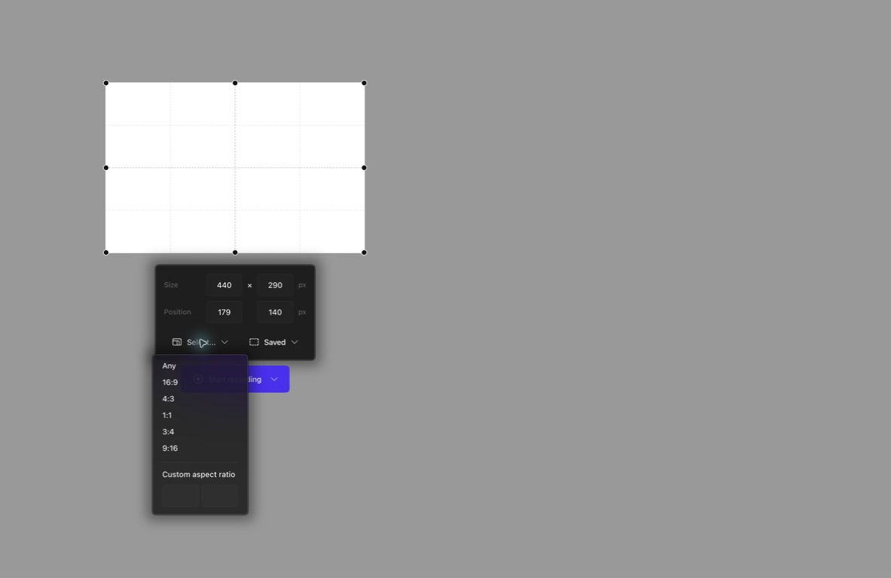

### 09–14 · RecordReady 当前界面：本轮实际采集

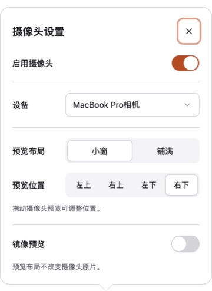

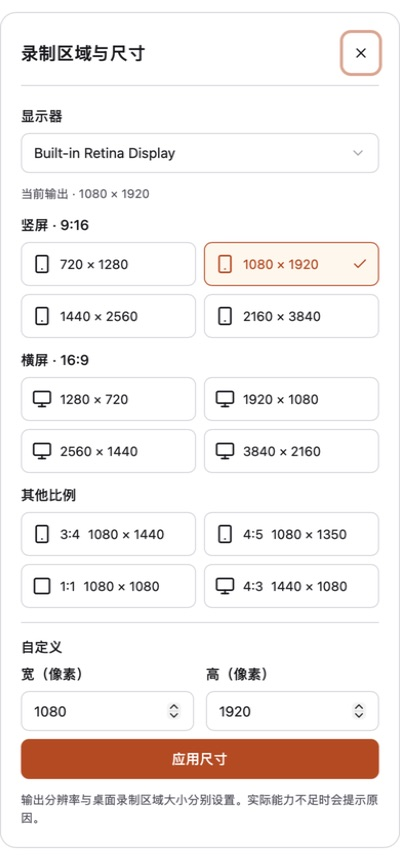

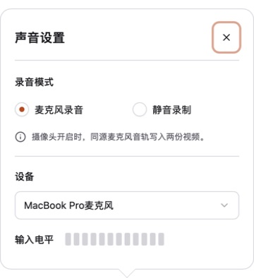

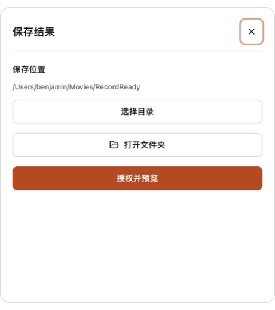

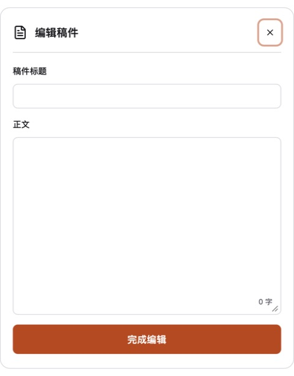

## 官方资料补充（不代替实测）

- [Speaker Notes](https://preview.screen.studio/guide/speaker-notes-)：文档说明备注入口、速度、透明度和字号，并说明不会进入成片；本轮只验证了界面，没有验证其成片排除。
- [Webcam & Microphone](https://preview.screen.studio/guide/webcam-microphone)：说明设备入口和隐藏预览与录制的关系，支持本方案区分“预览”与“输出”的方向。
- [Managing recording in progress](https://screen.studio/guide/managing-recording-in-progress)：文档描述计时与录制控制小窗；本轮未实测，不能据此认定暂停/重录已纳入 RecordReady。

建议先评审 B1–B4；确认后再更新对应视觉稿及 `design.md`，进入集中实现。
