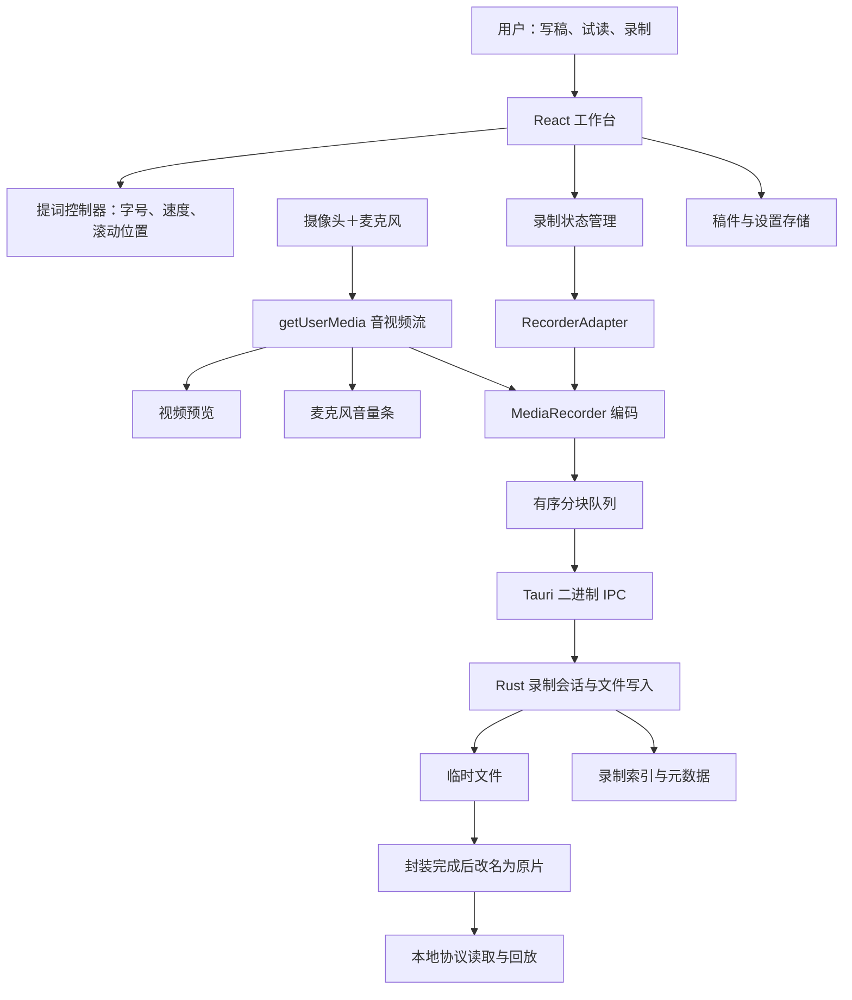
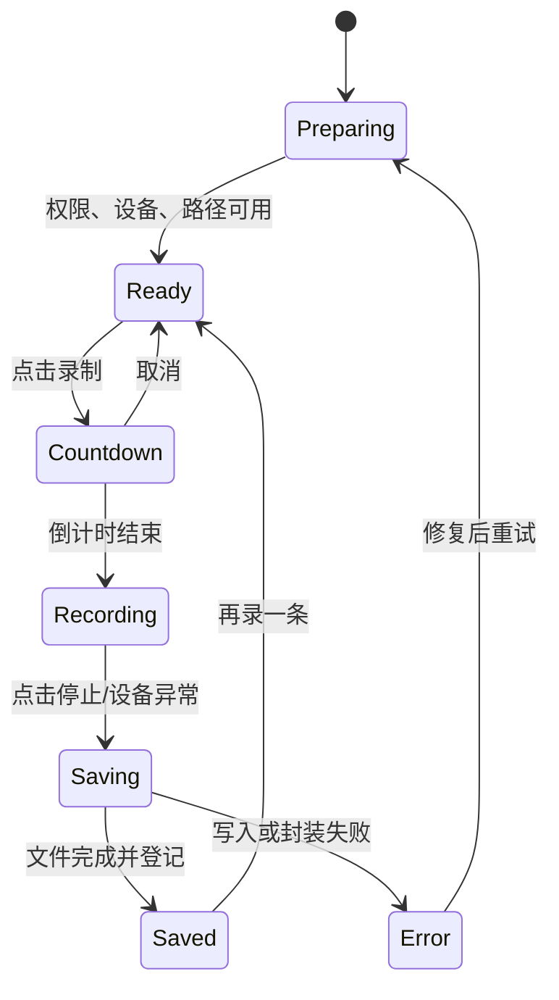
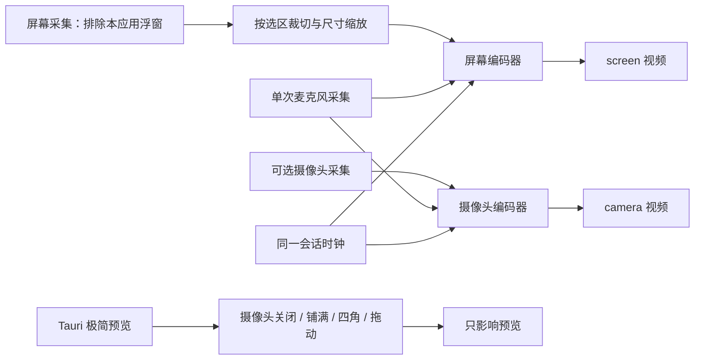

# 口播录制工具 · 第一版需求与技术方案

日期：2026-09-24　状态：开发建议稿，尚未实现正式应用

2026-09-24 交互修订：准备阶段保留工作台；录制阶段采用「线框＋提词＋摄像头」极简悬浮界面。新增摄像头铺满与右下角小窗原型。录屏与摄像头分轨需求已确认，以第 12 节的双视频保存方案为准；原摄像头直录方案仅作早期验证参考。

## 1. 产品目标

用一台电脑完成「写稿 → 看稿录制 → 自动保存原片 → 回看」。面向独立创作者、课程讲师和需要录制口播的普通用户。支持 macOS 和 Windows；技术采用 Tauri 2。

第一版成功标准：用户首次授权后，能够在一个工作台完成一次带声音的口播录制；提词文字不出现在成片中；停止后能找到并播放本地原片。

默认建议：离线运行、无需账号、单摄像头＋单麦克风、默认竖屏 9:16（1080×1920）、目标 30fps、默认 3 秒倒计时。设备不支持目标画质时使用实际可用分辨率并明确展示。第一轮支持范围建议为 macOS 13+（Apple Silicon、Intel）和 Windows 11 x64；这是产品拟定范围，须经实际打包验证，其他系统不列入首版验收承诺。

## 2. 第一版范围

| 模块 | 必须完成的行为 | 具体边界 |
|---|---|---|
| 设备准备 | 申请摄像头和麦克风权限；选择设备；实时预览 | 不录系统声音；新增录屏与摄像头独立保存，见第 12 节 |
| 声音检查 | 显示麦克风音量条；静音或持续无输入时提示 | 不做监听回放，避免扬声器啸叫 |
| 稿件编辑 | 标题、纯文本编辑、字数、本地自动保存 | 一个当前稿件；粘贴文本即可，不做复杂稿件库 |
| 提词器 | 预览上方居中显示稿件；手动滚动和自动滚动 | 只在应用界面显示，成片不含文字 |
| 提词设置 | 字号、滚动速度、开始/暂停滚动、回到开头 | 速度按滚动像素计算；语音跟读不在首版 |
| 视频录制 | 倒计时、开始、计时、停止 | 首版不做视频暂停/续录；暂停提词不影响录制 |
| 原片保存 | 停止后自动完成文件保存，展示结果 | 保留原始编码，不做 AI、美颜、剪辑或转码 |
| 回看与查找 | 本地播放、再次录制、在文件夹中显示 | 重录生成新文件，不覆盖上一条 |
| 最近录制 | 列表显示名称、时间、时长、文件格式、保存状态 | 只管理本应用录制的文件，不扫描全盘 |
| 基础设置 | 修改保存目录，记住所选设备和提词参数 | 设备失效时要求重新选择 |

后续版本候选：眼神校正、AI 跟读、字幕、剪辑、统一 MP4 导出、虚拟摄像头、云同步。首版没有这些功能入口。

## 3. 用户操作流程

1. 首次打开：展示录制工作台，说明需要摄像头和麦克风，用户点击「启用设备」后触发系统授权。
2. 准备：确认摄像头画面和麦克风音量，输入或粘贴稿件，选择保存位置。
3. 试读：点击「试读」，调字号和滚动速度；不开始录制。
4. 开始：点击「开始录制」，收起准备工作台，显示极简录制界面，倒计时 3 秒，归零时同时启动录像、计时和提词滚动。倒计时可取消。
5. 录制中：显示红点、时间和「停止录制」，锁定设备及保存目录；提词速度、字号和滚动暂停仍可调整。
6. 结束：点击停止，界面显示「正在保存」，等待最后一块音视频数据写入并关闭文件。
7. 完成：显示回放、文件名、目录、时长、格式，提供「在文件夹中显示」「再录一条」。

提词规则：文字显示在预览画面的上方，尽量靠近摄像头；当前阅读区域突出显示，文字宽度控制在短行范围。到达稿尾只停止滚动，录像继续。新一条录制从稿件开头开始。镜像只用于预览，原片方向保持摄像头原始方向。

## 4. 页面和原型

原型文件：`prototype/index.html`。直接打开即可使用，或者在项目目录运行 `python3 -m http.server 4173 --bind 127.0.0.1`，访问 `http://127.0.0.1:4173/prototype/index.html`。

这是可点击的交互演示，画面、设备、录制和保存均为模拟，不会访问摄像头或生成视频。

| 原型 | 布局 | 用途 |
|---|---|---|
| A · 准备工作台＋极简录制（建议） | 准备时编辑稿件；录制时收起工作台，显示线框、提词和摄像头 | 录制界面支持摄像头铺满或右下角小窗 |
| B · 沉浸提词 | 画面铺满工作区域，稿件浮在画面上方，控制集中底部 | 更专注读稿，减少其他界面干扰 |
| C · 分步准备 | 左侧准备清单，右侧先写稿，再检查画面，再录制 | 适合第一次使用，操作更明确 |

共同覆盖准备、倒计时、录制、保存完成四个状态，并展示最近录制。原型保留在本地待选型；当前目录没有 Git 仓库，不创建或提交分支。

建议采用 A，B/C 用于比较布局，正式开发只实现选定的一种。

## 5. 异常与数据保护

| 情况 | 产品行为 |
|---|---|
| 权限拒绝 | 显示缺少哪项权限、重试入口和系统设置指引；保留稿件 |
| 无设备/设备占用 | 展示原因；允许重新选择和重试；不进入录制 |
| 摄像头/麦克风中途断开 | 立即结束当前录制流程，尽力封装已收到的数据，明确标记是否成功保存 |
| 无音量 | 显示提醒，用户仍可主动继续录制 |
| 目录无权限/空间不足 | 开始前检查；录制中写入失败则停止并提示；保留临时数据供排查 |
| 录制中关闭窗口 | 明确询问「停止并保存后退出」或「继续录制」；不静默丢弃 |
| 保存中关闭窗口 | 等待保存结果后退出，保存失败时保留窗口显示原因 |
| 异常退出/断电 | 重启发现临时文件后提示可能未完整；不得宣称一定能恢复 |
| 历史文件被移动 | 显示「文件已移动或不存在」，不把它误报为录制失败 |
| 连续重录 | 自动生成唯一文件名，任何原片均不覆盖 |

## 6. 技术框架

| 层次 | 选型 | 职责 |
|---|---|---|
| 桌面容器 | Tauri 2 | 窗口、打包、原生权限、前后端通信 |
| 用户界面 | React + TypeScript + Vite | 工作台、稿件、提词、回放、状态显示 |
| 样式 | CSS 变量＋轻量组件 | 单窗口 MVP，无需引入完整设计系统 |
| 采集 | WebView 的 getUserMedia | 获取同一会话的摄像头与麦克风流 |
| 录制 | MediaRecorder | 浏览器引擎编码，按块交付音视频 |
| 声音检测 | Web Audio AnalyserNode | 只分析电平，不连接扬声器输出 |
| 本地服务 | Rust + Tauri commands | 验证路径、创建会话、按序写文件、结束保存 |
| 设置 | Tauri Store 插件 | 设备偏好、提词参数、窗口和目录设置 |
| 文件对话框/定位 | Tauri Dialog / Opener 插件 | 选择目录，在 Finder/资源管理器显示文件 |
| 稿件和索引 | 应用数据目录中的文本和 JSON | 小规模本地数据，不引入数据库或服务端 |

所有版本在开发开始时固定到锁文件。应用运行无需网络。正式发布需分别完成 macOS 签名/公证与 Windows 安装包签名；发布工作在功能验证之后进行。

### 跨平台录制格式

Tauri 在 macOS 使用 WKWebView，在 Windows 使用 WebView2，二者编码支持不可假定相同。先用 `MediaRecorder.isTypeSupported()` 探测候选格式，再实际创建录制器、做短录制验证；最后以录制器实际的 `mimeType` 为准。

优先尝试双方支持的 MP4；不可用时使用可录制、可播放的 WebM。扩展名严格对应实际容器，UI 展示真实格式。本版不保证所有机器直接产生 MP4，不打包 FFmpeg；如果统一 MP4 成为刚需，应单独增加导出转码能力并评估体积、时间和分发要求。

验证阻塞时：若任一目标系统的 Tauri 正式包无法稳定使用 WebView 录制，暂停扩大功能；保留 RecorderAdapter 接口，针对失败平台评估 macOS AVFoundation / Windows Media Foundation 原生录制。该替代方案增加开发量，不宣称已经验证可用。

## 7. 技术架构

提词文字属于 UI 层，不进入任何输出文件。最新方案分别采集屏幕与摄像头，保存两个独立文件；不合成画中画。

### 录制与保存时序

1. Rust 校验目录和空间，创建唯一 sessionId 和 `.part` 文件，前端进入倒计时。
2. 倒计时归零，MediaRecorder 开始录制；UI 使用单调时钟计算时间。
3. `dataavailable` 收到数据后，按序号经二进制 IPC 传给 Rust，并等待写入确认。建议从约 1 秒分块起测；timeslice 不保证精确，单块也不保证可独立播放。
4. 使用单一有序队列，限制待写入字节数；长时间写不动就结束录制并提示，避免内存随录制时长无限增长。不使用 Base64 传视频。
5. 停止时等待最后一次 dataavailable、stop 事件及队列清空；Rust flush/关闭文件，成功后将 `.part` 在同目录改名，最后更新元数据。
6. 成功事件到达后才显示「已保存」。写入确认只代表应用写入完成，异常断电仍可能损坏文件；分块保存不等于容器可恢复。
7. 原片和索引之间用临时元数据与原子替换降低不一致风险；重启按会话状态协调检查。回放路径只开放用户授权录制目录内的目标文件，使用支持视频 Range 请求的本地协议。

### 状态模型

提词另有 `idle / scrolling / paused / ended` 状态；暂停提词不触发录像状态变化。第一版不引入全局复杂状态库，使用 reducer 约束录制状态转换。

### 模块与数据

建议目录：`src/features/studio`（工作台）、`src/features/prompter`（提词）、`src/features/recordings`（回放和列表）、`src/lib/recorder`（采集适配）、`src-tauri/src/recording`（写入会话）、`src-tauri/src/storage`（目录与索引）。

关键命令：`begin_recording`、`append_recording_chunk`、`finish_recording`、`abort_recording`、`list_recordings`、`reveal_recording`。写入使用会话句柄，不接受前端任意文件路径；每块校验序号与所属会话。

原片默认保存到系统视频目录下的「口播录制」，不存在时引导选择；设置和稿件存入应用数据目录。每条记录包含 id、标题、创建时间、绝对路径、实际格式、实际分辨率、时长、字节数、保存状态。原片命名采用日期时间＋短随机标识，避免重名。

macOS 必须配置摄像头、麦克风用途说明及所需 entitlement，授权在正式打包应用中验证。Tauri capability 仅开放本功能需要的命令、目录选择与文件定位，不开放任意 shell。

## 8. 开发顺序和验收

| 阶段 | 交付 | 通过条件 |
|---|---|---|
| 0 · 录制可行性 | 最小 Tauri 正式包 | Mac 和 Windows 分别完成授权、30 秒音视频录制、磁盘保存和播放 |
| 1 · 工作台 | 稿件编辑、设备预览、音量条、提词 | 字号/速度生效；提词暂停与录制解耦；关闭重开恢复稿件 |
| 2 · 完整闭环 | 倒计时、录制、保存、回看、最近记录 | 连续录制 3 次不覆盖；成片没有提词文字；路径准确 |
| 3 · 异常及长录 | 打包测试、异常提示 | 拒绝权限、设备断开、目录不可写、空间不足、录制中退出行为符合上表 |
| 4 · 体验验收 | 双平台安装包、实录样片和结果记录 | 支持硬件分别进行 30 分钟长录；文件可播放，首尾音画同步偏差目标不超过 200ms，内存无持续无界增长 |

自动化覆盖：状态转换、块写入排序、最终数据等待、命名冲突、写入失败。设备权限、音画同步、长录性能、硬件兼容以实际桌面应用测试为准；浏览器原型通过不代表 Tauri 正式包通过。

本次交付仅为需求、架构与原型，尚未进行真实设备或 Tauri 录制验证。

## 9. 官方依据

- [Tauri WebView 平台差异](https://v2.tauri.app/reference/webview-versions/)
- [MediaRecorder 格式探测](https://developer.mozilla.org/en-US/docs/Web/API/MediaRecorder/isTypeSupported_static)
- [MediaRecorder 数据块与结束事件](https://developer.mozilla.org/en-US/docs/Web/API/MediaRecorder/dataavailable_event)
- [Tauri 前端调用 Rust 与原始二进制数据](https://v2.tauri.app/develop/calling-rust/)
- [macOS 摄像头与麦克风权限](https://developer.apple.com/documentation/avfoundation/capture_setup/requesting_authorization_to_capture_and_save_media)
- [Tauri Store](https://v2.tauri.app/plugin/store/)、[Dialog](https://v2.tauri.app/plugin/dialog/)、[Opener](https://v2.tauri.app/plugin/opener/)

## 10. 录制界面修订与录屏扩展方案

### 10.1 交互决策

原工作台适合准备稿件、检查设备；实际录制使用单独的极简界面。在浏览器原型中用模拟桌面展示，在正式 Tauri 应用中应采用透明悬浮窗口，让用户继续操作下方真实的 PPT、浏览器或其他软件。

- 线框：指示成片范围；准备时可选区域，开始后锁定。线框本身不进入成片。原型支持下拉选择比例或自定义宽高，线框同步变化；尚未实现拖拽选区。
- 提词：默认位于线框顶部中央，短行显示，可暂停滚动。正式界面允许调整位置以避开屏幕内容；文字永远不进入成片。
- 摄像头铺满：只改变录制时的预览布局，屏幕轨仍然录制，摄像头轨独立保存。
- 摄像头小窗：可选左上、右上、左下、右下；选定后支持手动拖动。位置只影响预览，不写入屏幕视频；后期可自由摆放。
- 小控制条：计时、两种摄像头布局、暂停提词、停止。录制时淡出，悬停或键盘聚焦时恢复；停止必须始终可达，正式应用增加停止快捷键。
- 停止录制：收起悬浮界面，返回保存结果和回放。

新增截图：`prototype/screenshots/06-screen-pip.png` 与 `07-camera-full.png`。从工作台「预览极简录制」进入，或者点击开始录制自动进入。两种布局可在原型内切换。屏幕、摄像头、录制文件全部为模拟。

### 10.2 成片与操作界面的关系

| 画面元素 | 用户录制时看到 | 最终视频包含 |
|---|---|---|
| 选定屏幕区域 | 小窗模式可见 | 始终保存到屏幕视频 |
| 摄像头画面 | 开启时可见，可铺满或小窗 | 开启时保存到独立摄像头视频，不叠加到屏幕视频 |
| 提词文字 | 是 | 否 |
| 选区线框 | 是 | 否 |
| 计时和操作按钮 | 临时显示 | 否 |

录屏版保存屏幕和摄像头两个独立视频。摄像头关闭时只保存屏幕视频。以第 12 节为当前输出规则。

### 10.3 架构影响

Tauri 2、React、Rust 保留。屏幕与摄像头使用独立编码输出，共用会话时间基准。Mac 评估 ScreenCaptureKit，Windows 评估 Windows.Graphics.Capture；原生平台适配层需排除本应用浮窗。网页 getDisplayMedia 只作经过目标 WebView 实测后的候选。

需要验证三个关键点：

1. 排除录制工具自己的提词/摄像头预览/控制窗口，摄像头独立编码，避免屏幕视频中混入摄像头或无限套娃。
2. 浮窗透明区域鼠标穿透，下方软件可正常点击；按钮和提词区域保持可交互。键盘焦点不应因开始录制就持续抢占。
3. macOS Retina 和 Windows 缩放下，线框坐标转换为真实像素；锁定目标显示器，处理窗口移动、显示器拔出及权限被取消的情况。

录屏版仍建议先只录麦克风声音；系统声音是否加入属于独立需求。Windows 自绘边框不替代操作系统自身可能显示的捕获提示。

### 10.4 增补验收

分别在 Mac 与 Windows 测试：录 PPT/浏览器、提词不入镜、浮窗不被采集、底层软件可点击、预览布局切换不影响任一文件、屏幕文件完全不包含摄像头、高 DPI 选区准确、画中画不过界、停止后文件可播放且音画同步。当前只验证了原型界面，以上原生能力均待实现和实机验证。

依据：[Apple ScreenCaptureKit](https://developer.apple.com/documentation/screencapturekit/capturing-screen-content-in-macos)、[Windows 屏幕采集](https://learn.microsoft.com/en-us/windows/uwp/audio-video-camera/screen-capture)、[getDisplayMedia 兼容性](https://developer.mozilla.org/en-US/docs/Web/API/MediaDevices/getDisplayMedia)。

## 11. 录制尺寸（已确认）

默认 9:16。准备工作台与极简界面均提供尺寸下拉框，支持 9:16、16:9、3:4、4:3、自定义。内置预设分别对应 1080×1920、1920×1080、1080×1440、1440×1080 像素。比例与输出分辨率同时展示，避免混淆。

自定义输入宽、高（像素），点击「应用尺寸」后生效。第一版建议限制每边 240–3840 的偶数像素；空值、负数、奇数或超出范围显示提示，保留此前有效尺寸，不静默改值。该范围是产品初始限制，正式支持能力须实机验证。

调整后同步更新屏幕预览、线框与屏幕文件元数据；摄像头保持设备实际输出画幅，独立记录其尺寸。线框在屏幕上按比例缩放显示，不等于输出像素的物理大小。倒计时、录制和保存中锁定尺寸；停止后可以修改。选择不同尺寸不拉伸人像：摄像头按比例居中裁切，正式录制前通过预览检查构图；画中画保持自身比例并固定在框内右下角。录屏区域应与输出比例一致，原生捕获后按目标尺寸合成编码。

屏幕文件按选定尺寸实际裁切/缩放和编码，摄像头文件保持自身实际分辨率；不能只修改元数据冒充尺寸变化。分别验证两份文件清晰度、实际尺寸以及时间同步。

验收增加：首次进入 9:16；四种预设比例正确；自定义合法值正确应用；错误值有提示且不改变有效线框；录制时不能改尺寸；两种摄像头布局不过界；保存结果记录实际录制时选定的宽高。

## 12. 摄像头控制与双视频保存（当前确认方案）

- 摄像头可关闭。默认开启，初始小窗位于右下角。
- 摄像头位置下拉：左上、右上、左下、右下。选定位置后可继续手动拖动，限制在录制边框内，显示「手动位置」；再次选择四角可重新对齐。
- 保留摄像头铺满预览；切回小窗恢复上次位置。预览位置、大小、镜像和铺满均不改变源视频，屏幕轨始终独立。
- 初版摄像头开关在开始前设置，倒计时到保存结束期间锁定；录制中仍可移动/切换预览布局。这样避免中途关闭导致摄像头源轨缺口或分段。若后续需要中途启停采集，应另加片段与时间轴规则。
- 开启摄像头：每次保存 `screen.<实际格式>` 和 `camera.<实际格式>`，放在同一会话目录。关闭摄像头：只保存 `screen.<实际格式>`，不创建空摄像头文件。
- 屏幕文件不包含摄像头、提词、边框、控制条。摄像头文件不包含桌面内容、提词或其他界面。摄像头保持完整原始画幅，不能按预览小窗尺寸压低源片分辨率。
- 录制尺寸默认 9:16 等设置作用于屏幕输出；摄像头源片独立保留设备实际尺寸，以便后期任意裁切。
- 音频默认建议：麦克风采集一次，同源声音写入两份视频，方便单独观看和后期对齐；剪辑叠加时保留一条音轨以免重音。暂不录系统声音。

### 12.1 保存和同步

同一会话时钟下开始/结束两个录制器。不能依靠顺序调用两个 start 就宣称帧级同步；记录首帧/首个音频采样时间、启动偏移、实际结束时间，在输出时对齐起点，并以样片验证。单一麦克风时间戳作为公共音频基准。

Rust 为每条轨道维护独立有序写入队列、文件句柄和终止状态；视频大块数据不跨轨混写。元数据保存 sessionId、两份文件路径、尺寸、格式、时长、时间偏移、错误与完成状态。摄像头开启时两个编码器均就绪才进入录制；开始失败则明确提示，不静默缺失一条。

停止后分别等候两条轨道最终数据、写入和封装完成。两份都成功才显示「两份独立视频已保存」。一份失败保留另一份，展示「部分保存」及具体文件状态并允许重试，不覆盖已成功原片。摄像头关闭则只等待屏幕轨。

### 12.2 验收

- 开关摄像头后，预览与保存文件数一致。
- 四角定位正确，随后能自由拖动且不越界；变更比例后位置仍在框内。
- 预览铺满/移动不影响屏幕源片内容，不把摄像头烘焙到屏幕文件。
- 开启时输出两个可独立播放的视频；关闭时只有一个。
- 两视频开头、结尾与声音同步目标偏差不超过 200ms，实机验证 30 分钟长录。
- 任意轨道异常分别报告，不误报全部成功。

本次原型演示开关、四角定位、鼠标拖动、两种预览与独立文件列表；并未进行真实双流采集、文件写入或同步验证。
