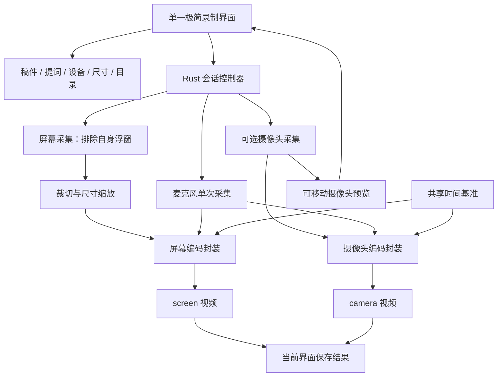

# 口播录制工具 · 分期需求与技术方案

更新：2026-09-24。当前交付为可交互原型，真实 Tauri 应用尚未开发。

**正式开发启动条件：用户审阅最终方案、开发范围及未验证限制后明确批准。此前只推进方案、技术验证和临时原型；“继续”不视为正式开发授权。** 当前状态见 [开发前评审清单](开发前评审清单.md)。

## 1. 分期决定

**第一期只做极简录制界面：录制线框＋提词＋可选摄像头＋底部控制条。** 打开应用直接进入，所有准备、设置、开始、停止及保存提示都在这一界面完成。设置使用就近小浮层，不跳转到独立页面。

**第二期保留原工作台、独立稿件编辑页、最近录制/视频库、独立回放页，以及 A/B/C 布局探索。** 当前不开发这些正式页面，也不在第一期放置「返回工作台」「最近录制」等入口。

- 第一期原型：`prototype/index.html`。
- 第二期保留原型：`prototype/phase2/index.html`，可单独打开，不从第一期导航进入。
- 分期前完整方案：`docs/archive/口播录制工具-分期前方案.md`。历史内容与当前决定不同时，以本文件为准。

### Mac 首批交付范围（已确认）

首批覆盖 Apple Silicon（M 系列 Mac），以独立安装包分发，色彩范围为 SDR。Intel Mac、Mac App Store 上架及 HDR 延后。最低系统版本、具体机型、输出尺寸和帧率仍由实测决定，不能把本范围视为全部 M 系列已通过验证。Windows 按既定双平台目标保留，实机验证暂缓。详见 [Mac 首版支持范围草案](Mac首版支持范围草案.md)。本确认不授权正式开发。

## 2. 第一期配置放在哪里

| 位置 | 配置和操作 | 交互规则 |
|---|---|---|
| 线框上方 | 录制尺寸、比例、自定义宽高 | 默认 9:16，开始前设置 |
| 提词区域下沿 | 编辑稿件、字号、滚动速度、回到开头 | 字号和速度立即生效；编辑在旁边小浮层内完成 |
| 摄像头小窗右上角 | 摄像头设置按钮 | 点击展开设备选择、开关、铺满/小窗、四角位置 |
| 摄像头设置小浮层 | 内置/外接摄像头选择、关闭、左上/右上/左下/右下 | 关闭后仍可从底部「摄像头设置」重新开启 |
| 摄像头画面 | 手工拖动 | 四角定位后仍可拖动，限制在框内；位置只影响预览 |
| 底部控制条 | 状态/计时、摄像头设置、麦克风选择、音量、暂停提词、开始/停止、保存位置 | 保留常用入口，录制时淡出，悬停/聚焦显示 |
| 保存位置小浮层 | 选择本地目录 | 正式版用系统文件夹选择器；原型仅切换示例目录 |
| 当前界面角落 | 保存完成/失败提示、文件列表、打开文件夹、再录一条 | 显示本次结果，不跳转历史库，不新增回放页 |

原型中的桌面、设备、音量、录制及文件均为模拟，不触发实际系统权限或写入视频。

## 3. 操作流程

1. 打开后直接显示极简录制界面；首次使用在本界面说明并申请屏幕、有声模式下的麦克风和已开启摄像头所需权限。
2. 在线框顶部选尺寸；提词区点击「编辑稿件」，粘贴内容，调整字号和滚动速度。
3. 选择摄像头/麦克风，确认声音；摄像头可关闭、铺满预览、四角定位或手动拖动。
4. 选择保存目录；点击开始，完成检查和 3 秒倒计时后请求开始录制；后台确认所需轨道实际开始，才显示录制中、启动计时和提词滚动。
5. 录制中允许调整提词字号/速度、暂停提词、摄像头预览位置。录制区域的位置和大小、尺寸、设备、摄像头采集开关、保存目录从倒计时开始锁定，防止源轨中断。
6. 点击停止，等待实际文件写入和封装完成。在当前界面提示本次保存结果，可打开文件夹或再录一条。

稿尾只停止提词滚动，不停止录像。新一条从稿首开始。第一期不做录像暂停/续录。关闭窗口时，录制中须停止并保存或取消退出；保存中等待结束，不静默丢片。

## 4. 录制尺寸

| 分类 | 比例 | 可选输出尺寸（宽×高） |
|---|---|---|
| 竖屏 | 9:16 | 720×1280、**1080×1920（默认）**、1440×2560、2160×3840 |
| 横屏 | 16:9 | 1280×720、**1920×1080（常用）**、2560×1440、3840×2160 |
| 其他竖版 | 3:4 | 1080×1440 |
| 其他竖版 | 4:5 | 1080×1350 |
| 方形 | 1:1 | 1080×1080 |
| 其他横版 | 4:3 | 1440×1080 |
| 自定义 | 由宽高决定 | 用户输入宽、高像素后应用 |

按竖屏、横屏、其他画幅分组，共 12 个预设，不按平台重复相同尺寸。默认尺寸是跨平台制作建议，不代表任何平台唯一允许的上传尺寸。1440 和 4K 档用于需要更高输出分辨率的场景，不保证平台原样保留清晰度，也不代表本工具已通过该尺寸的实际录制验证。研究依据与尚未核实的平台列于 [视频平台尺寸调研](视频平台尺寸调研.md)。

第一版建议自定义每边 240–3840 的偶数像素；输入不合法时提示并保留此前有效值。该上限是产品初始约束，最终支持能力以实机验证为准。自定义通过「应用尺寸」明确生效；空值、小数、奇数和越界值就近提示，不自动修改输入、不覆盖此前有效尺寸。切换预设或应用自定义后，线框使用新宽高比，尽量保留原中心并缩入当前显示器边界；不裁切或拉伸为其他比例。倒计时和录制期间，预设、自定义输入与应用按钮均锁定。

尺寸作用于**屏幕视频的输出分辨率**。摄像头原片保留设备实际画幅和分辨率，不因预览小窗缩小而降低源片质量。

开发前证据（2026-09-24）：当前 M4 Pro / macOS 26.4 临时实验已输出 1280×720、1920×1080、1080×1920；新横竖 1080 样片各约 30 秒，双视频解码通过、抽查四角和网格比例正常，摄像头保持 1920×1080。屏幕尚非稳定 30fps，竖屏开头最大帧间隔约 217ms；其他预设、自定义和其他系统仍待验收。详见 [Mac 首版支持范围草案](Mac首版支持范围草案.md)。

#### 录制区域与提词交互（已确认）

- 第一期在一个显示器内选择固定矩形区域，不跨显示器，不自动跟随应用窗口。移动下方应用不会移动录制区域；普通窗口遮住区域时，遮挡内容也会录入。应用自己的线框、提词、摄像头预览及工具条必须排除。
- 拖动线框顶部把手移动录制区域；拖动四角按所选比例缩放，边界限制在所选显示器内。选择另一个显示器只允许在准备阶段完成。
- 输出分辨率与录制区域分开：例如输出设为 1080×1920，拖大线框只是捕获更多桌面内容，最终仍缩放为 1080×1920。正式实现需验证屏幕像素、高 DPI 与输出像素映射。
- 从 3 秒倒计时开始，录制区域的位置、大小、显示器和输出分辨率锁定，停止录制后解锁。提词和摄像头预览可独立移动，不改变录制区域。
- 提词可移到录制线框外；正文鼠标穿透，下方软件仍可点击。只有提词拖动把手及编辑、字号、速度、暂停等控件响应操作。

交互规则已由用户确认；独立浏览器原型仅验证操作与状态，不能替代原生排除窗口和捕获验证。

## 5. 摄像头与独立视频

- 默认开启摄像头，预览小窗在右下角；可选左上、右上、左下、右下，随后继续手动拖动。
- 铺满/小窗、位置、预览镜像只影响用户看到的画面。即使摄像头铺满，屏幕轨也继续录制。
- 开启摄像头时，保存 `screen.<实际格式>` 和 `camera.<实际格式>` 两个独立视频，放在同一会话目录。
- 关闭摄像头时，仅保存屏幕视频，不创建空摄像头文件。初版在录制前设置采集开关，录制中不启停摄像头源轨。
- 屏幕文件不包含摄像头、提词、线框和工具条；摄像头文件不包含桌面、提词或其他界面。
- 音频初始建议：麦克风只采集一次，同源音轨写入两份视频，便于独立播放和后期对齐。后期叠加时只保留一份音轨以免重音。暂不录系统声音。

## 6. 技术框架

| 层 | 选型 | 职责 |
|---|---|---|
| 桌面容器 | Tauri 2 | 跨平台窗口、打包、系统权限、前后端通信 |
| 界面 | React + TypeScript + Vite | 单一录制界面及就近配置浮层 |
| 本地服务 | Rust | 会话、设备、轨道生命周期、保存和错误状态 |
| macOS 屏幕采集 | ScreenCaptureKit | 捕获屏幕/窗口，排除应用自身浮窗 |
| Windows 屏幕采集 | Windows.Graphics.Capture | 获取系统显示器/窗口帧 |
| 摄像头和音频 | 平台采集适配层 | macOS 评估 AVFoundation，Windows 评估 Media Foundation/音频采集接口 |
| 录制输出 | 独立编码器与封装器 | 屏幕与摄像头各一路，共用时间基准 |
| 本地数据 | 应用数据目录文本/JSON＋Tauri Store | 稿件自动保存、设备偏好、尺寸、位置、保存目录 |
| 目录与文件定位 | Tauri Dialog / Opener | 系统目录选择器和 Finder/资源管理器定位 |

视频帧在原生采集/编码层处理，避免把每帧高清像素通过 JSON 传到网页。前端只发送命令、接收状态和预览所需数据。技术可行性验证后确定平台桥接与预览传输方式，不声称已完成双平台验证。

目标优先验证 macOS 13+（Apple Silicon、Intel）与 Windows 11 x64；最终最低系统版本受实际采集/编码接口限制。版本固定于锁文件。正式分发分别完成 macOS 签名公证和 Windows 安装包签名。

### 6.1 已确定的技术组合

**采用 Tauri 2 + React + TypeScript + Rust。第一期不部署服务器，不提供 Node 后端。**

React 是本项目选定的界面方案，不是 Tauri 强制要求；采用它便于维护提词、多个配置浮层与第二期扩展。Node.js 仅用于开发环境的包管理、Vite 构建等工具链，不作为应用运行时随安装包启动。用户安装应用后不需要安装 Node.js 或 Rust 开发环境。

| 技术 | 做什么 | 不承担什么 |
|---|---|---|
| React + TypeScript | 提词显示与滚动、尺寸和设备设置、摄像头预览布局、当前保存结果 | 不管理最终视频文件，也不负责原生屏幕捕获 |
| Tauri 2 | 承载界面、窗口控制、命令通信、安装包分发 | 不自动提供完整跨平台双视频录制引擎 |
| Rust | 应用内的本地后端：会话状态、参数校验、调用平台适配层、文件保存与错误处理 | 不需要运行 HTTP 服务或云端 API |
| 平台原生模块 | 屏幕/摄像头/音频采集、预览输出、编码封装、浮窗排除 | 不承载业务页面 |
| Node.js | 开发与构建工具 | 不作为录制后台进程或最终用户依赖 |

### 6.2 前端实现

- 一个主录制页面，摄像头、稿件和保存配置使用小浮层；第一期不引入页面路由或视频库。
- 按职责拆分 `RecordingSurface`、`CaptureFrame`、`Prompter`、`CameraPreview`、`RecordingToolbar` 和各配置浮层。
- 使用 React 状态/reducer 管理界面；Rust 是录制会话状态的权威来源。开始按钮只提出请求，收到后台确认后才显示正在录制。
- 提词使用独立控制器与滚动位置，暂停、字号和速度不干扰音视频线程。稿件和偏好通过防抖保存到本地。
- 摄像头预览坐标使用相对框宽高的归一化值；比例或窗口大小变化后重新布局，并限制边界。预览位置不写入任何视频源轨。

### 6.3 Rust 本地后端与模块边界

建议目录：

```text
src/
  features/recording/       单界面、设置浮层与提词
  lib/native/              类型化 Tauri 命令与事件封装
src-tauri/src/
  commands/                前端命令入口
  session/                 会话状态与两轨调度
  capture/                 平台无关的设备和采集接口
  recording/               编码、封装与音视频时间戳
  storage/                 文件路径、临时文件、设置与会话清单
  platform/macos/          macOS 原生适配
  platform/windows/        Windows 原生适配
```

Rust 对外提供统一的设备枚举、权限状态、准备、开始和停止接口；屏幕和摄像头分别实现采集适配。macOS 如需 Swift/Objective-C 桥接，则通过边界明确的原生接口调用；Windows 使用 Rust 可调用的 Windows API 绑定，必要时补充原生桥接。桥接方式在技术验证阶段确定，不预设某个第三方录制库已经满足全部要求。

音视频采集和编码在后台任务/平台回调中运行，不阻塞界面线程。每条轨道使用有界缓冲；持续处理不过来时报告具体错误并结束保存，避免无限占用内存。

### 6.4 前后端通信约定

| 命令/事件 | 内容 |
|---|---|
| `get_capabilities` | 当前平台实际支持的尺寸、帧率、格式与权限状态 |
| `list_devices` | 显示器、窗口、摄像头和麦克风的可选项 |
| `prepare_session` | 校验设备、选区、输出尺寸、目录、空间，返回会话 ID |
| `start_recording` | 按会话 ID 启动已准备的轨道，重复请求不得创建重复录制 |
| `stop_recording` | 结束采集并封装，重复停止应返回同一会话结果 |
| `get_session_state` | 界面重载或重连后读取真实录制状态 |
| `save_preferences` | 保存稿件及设置 |
| `reveal_session` | 在系统文件管理器定位该会话目录 |
| `session_state` / `track_error` | 向界面报告录制状态和逐轨错误 |
| `audio_level` / `save_result` | 限频报告音量，以及各文件最终保存结果 |

命令通过 Tauri IPC 发送，不建立本地 Node HTTP 服务。IPC 主要传配置、会话 ID 和状态；原始高清视频帧不通过 JSON/base64 逐帧传输。摄像头预览优先验证原生渲染视图或专用视频通道，控制层只同步布局；具体跨平台通道由第一轮性能验证确定。

### 6.5 单界面与系统窗口

“一个界面”是用户操作层面的要求，不强制底层只有一个系统窗口。为实现透明穿透、可点击控件和摄像头原生预览，可以使用相互协调的边框窗口、提词窗口、摄像头窗口和工具条窗口；用户始终留在同一录制场景。

所有本应用浮窗必须排除在屏幕捕获之外。macOS 与 Windows 分别验证排除机制；若目标系统无法可靠排除，不能通过测试截图假定正式录屏也有效。跨显示器、Retina/缩放、置顶及焦点行为须用正式安装包检查。

### 6.6 本地数据与保存结果

```text
用户选择的保存目录/
  日期时间_唯一会话ID/
    screen.<实际格式>
    camera.<实际格式>      摄像头关闭时不存在
    session.json           实际尺寸、时长、格式、同步偏移与保存状态
```

应用设置与稿件放在系统应用数据目录；视频放在用户选择的目录。第一期不用数据库。Rust 验证授权目录与会话归属，前端不能凭任意路径直接覆盖文件；新会话使用唯一名称。

屏幕与摄像头分别维护临时文件和完成状态。麦克风只采集一次并分发给两个输出。两路实际时间戳转换到同一单调时钟，必要时补偿启动偏移与时钟漂移；实现细节通过真实短录样片验证。第一期不要求 30 分钟长录验证，也不据短录结果承诺长期漂移表现。原生编码优先利用可用硬件加速；具体编码器、容器和失败降级策略在设备验证后固定。

### 6.7 开发与交付关卡

1. **原生能力验证**：Mac/Windows 各自跑通屏幕＋摄像头＋单麦克风、独立文件、浮窗排除和预览。先做短录与实际播放，确认依赖和最低系统要求。
2. **Tauri 界面接入**：将当前原型重写为 React 组件，接 Rust 命令与状态；保留第一期单界面范围。
3. **可靠性验证**：设备断开、目录无权限、空间不足、部分保存、退出保护、重复开始/停止与前端重连。
4. **双平台验收与打包**：验证短录与连续录制、实际画幅、样片首尾同步及录制期间的内存表现，再生成对应安装包；不以 30 分钟长录作为交付门槛。

本方案明确了实施路线；摄像头预览通道、编码器组合、透明浮窗排除和双轨同步仍属于需要真实桌面环境证明的技术关卡。

## 7. 技术架构



UI 浮窗必须排除在屏幕采集中，防止提词入镜和画面无限套娃。透明区域及提词正文鼠标穿透，下方软件可正常操作；按钮、提词把手及摄像头拖动区域保持交互。双平台高 DPI 坐标转换、准备阶段切换显示器、系统权限与焦点均需实测；第一期不支持单个录制区域跨显示器。

录制状态：`准备 → 倒计时 → 录制 → 保存 → 完成/部分保存/失败`。提词滚动状态独立管理，暂停提词不影响录制。

两条轨道共享会话时钟，记录各自首帧/首音频采样时间、实际启动偏移和结束时间。不能仅顺序调用两个 start 就宣称同步。输出起点对齐，以真实样片验证首尾误差。

每条轨道独立文件句柄和有序写入队列；最终数据写入、关闭封装成功后才将临时文件改名为正式文件。开启摄像头时两份均完成才能提示全部保存；一份失败时保留另一份，显示部分保存及错误。元数据记录实际格式、尺寸、时长、路径、同步偏移、错误和状态。

原型以 MP4 示意，正式版本的容器与编码须平台验证后确定；文件扩展名必须匹配实际容器。异常断电下不能承诺所有临时文件均可恢复。

## 8. 第一期异常与验收

- 权限拒绝、无设备、设备被占用：在当前界面明确提示、重试或选设备，稿件保留。
- 摄像头关闭仍能录屏；开启后须确认屏幕、摄像头及有声模式下的麦克风都准备好再录制；静音录制须由用户主动选择。
- 开关与四角定位正确，拖动不越框；比例变化后预览仍在框内。
- 字号/速度直接改变提词效果；编辑、保存目录设置均不离开本界面。
- 录制中相关设备、尺寸、目录锁定；停止和保存状态始终可达。
- 两份独立视频均可播放；只录屏时仅一份文件；重录不覆盖旧片。
- 屏幕视频不包含摄像头/提词/工具条，摄像头源片保持完整自身画幅。
- 目录不可写、空间不足、设备断开：逐轨报告错误与保存状态，保留成功文件。
- 双平台正式包分别测试授权、30 秒短录、连续 3 次录制；样片中两轨和声音首尾同步目标偏差不超过 200ms，观察录制期间内存是否异常增长。30 分钟长录不属于第一期必验项，短录结果不代表长期稳定性已验证。

开发顺序：先验证双平台采集、浮窗排除与独立保存，再实现本界面与配置，最后完成异常、短录同步和连续录制验收。浏览器原型检查不代替真实 Tauri 应用验收。

### 8.1 会话与失败语义（已确认）

用户确认：默认要求麦克风，可主动选择静音录制；必需设备中途失效时结束整次录制并保留可保存内容；倒计时允许取消，录制中退出须选择继续或停止并保存。

| 阶段或情境 | 用户可观察的行为 |
|---|---|
| 准备 | 默认有声录制。麦克风不可用时阻止开始，并提供重试、选择设备或主动选择「静音录制」。静音模式持续显著标识；两份视频均无音轨，不伪造静音音轨。摄像头仅在预先开启时属于必需轨道。 |
| 开始前检查 | 校验权限、必需设备、实际支持的输出尺寸及保存目录可写。发现问题留在准备阶段并保留稿件，不进入虚假的录制状态。空间检查不能保证后续一定充足。 |
| 3 秒倒计时 | 区域、尺寸、显示器、设备、音频模式和目录已锁定；允许取消，返回准备，不生成成片。临时资源应释放；释放完成前不接受再次开始。 |
| 正在启动 | 倒计时结束不等于录制成功。后台确认所需轨道已实际开始后，才显示「录制中」、启动正式计时及提词；启动失败停止所有已启动轨道，显示错误，不提示成功。 |
| 录制中 | 不能切换音频模式或中途关闭摄像头采集；提词暂停不暂停视频。屏幕、已启用摄像头或有声模式麦克风中任一失败，停止整次会话，尽力封装已录数据，显示原因。静音模式不依赖麦克风。 |
| 停止与保存中 | 停止接收新录制内容，界面显示「保存中」，逐文件等待写入及封装结果。重复停止返回同一会话状态，不重复封装；保存未结束不能再录一条。不得仅凭文件存在就提示成功。 |
| 正常保存完成 | 所需文件全部封装成功且未因故障提前终止，显示「全部保存」，列出文件并可打开目录；未启用摄像头时仅屏幕文件成功即可。 |
| 故障中断但文件均保留 | 显示「录制中断，已保存中断前内容」，同时显示中断原因和各文件实际时长，不用正常的「全部保存」掩盖录制提前结束。 |
| 部分保存 | 至少一个所需文件成功、至少一个失败，明确列出已保存和失败文件，保留成功文件，可打开目录。 |
| 保存失败 | 没有可确认完成封装的文件，提示原因和残留文件位置（如有）；残留临时文件不冒充可播放成片。不承诺断电、崩溃后一定恢复，也不自动删除可能可恢复的残留。 |
| 目录失效或空间耗尽 | 开始前发现则阻止开始；录制中发现则中断并尽力保存，按各文件实际结果报告。不默默换目录、不覆盖已有视频。 |
| 关闭窗口 | 准备阶段可退出；倒计时关闭即取消并释放资源后退出；启动中先取消启动并完成清理。录制中提供「继续录制」「停止并保存」，后者等待保存结果后退出。 |
| 保存中关闭 | 等待正在进行的同一次保存，不触发第二次停止。若保存失败或部分保存，保持结果界面，用户可打开目录或明确选择退出；保存仍未完成时不声称可以安全退出。 |
| 重复开始与界面重连 | 同一次开始请求只产生一个会话；忙碌时拒绝新开始。界面重连后读取后台现有会话状态，恢复计时、锁定及结果，不自动再开一条。后台已终止则显示连接/录制中断，不假装仍在录制；重启后只检查残留，不自动续录或承诺修复。 |

停止采集后区域可解锁供下次准备，但新设置不能改变正在保存的本次会话信息。文件名使用唯一会话标识，任何重试不覆盖以前的成片。

验收覆盖：有声缺麦克风时禁止开始、主动静音录制、倒计时取消与取消/开始竞争、启动部分失败、三类必需源分别中断、目录失效、空间耗尽、正常/中断/部分/全部失败结果、重复命令、界面重连以及录制和保存期间关闭窗口。使用可控故障注入验证，无需恢复已取消的 30 分钟长录测试。本节确定产品合同，尚未实现或验证正式异常处理。

## 9. 第二期保留内容

原工作台、A/B/C 布局原型、独立稿件编辑页面、最近录制/视频库、独立回放页面完整保留，延后评估与实现。第一期必要的稿件编辑、设备与保存设置已经迁移到单界面小浮层，不能因为独立页面延期而缺失这些功能。

AI 眼神校正、字幕、剪辑、云同步、系统声音、虚拟摄像头等仍为后续候选，不因第二期保留界面而自动纳入第二期承诺。

## 10. 官方技术依据

- [Tauri 架构](https://v2.tauri.app/concept/architecture/)
- [Tauri Rust 命令与通信](https://v2.tauri.app/develop/calling-rust/)
- [Apple ScreenCaptureKit](https://developer.apple.com/documentation/screencapturekit/capturing-screen-content-in-macos)
- [Windows 屏幕采集](https://learn.microsoft.com/en-us/windows/uwp/audio-video-camera/screen-capture)
- [Tauri Dialog](https://v2.tauri.app/plugin/dialog/)、[Opener](https://v2.tauri.app/plugin/opener/)、[Store](https://v2.tauri.app/plugin/store/)
